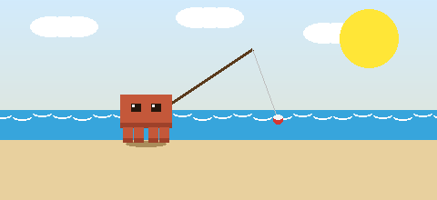

<div align="center">



# Claude Buddy

**Monitor físico de sessões do Claude Code — ESP32-S3 com display TFT 240×320**

[](https://github.com/izrafilcst/claude-buddy/stargazers)
[](LICENSE)
[](https://platformio.org)
[](agent/)

</div>

---

## Por que o Claude Buddy existe?

Passar horas programando com o Claude Code é produtivo — mas invisível. Você não sabe quanto da sua cota mensal já consumiu, quantas sessões estão abertas em paralelo ou quando está chegando perto do limite sem checar o painel na web.

O **Claude Buddy** resolve isso com um dispositivo físico que fica na sua mesa. Um mascote virtual — o **Orb** — vive no display e reflete o estado das suas sessões em tempo real: relaxado quando tudo está tranquilo, cansado quando a cota está alta, exausto quando está no limite. Sem abrir o browser. Sem distrações.

É o Tamagotchi do seu agente.

---

## Como funciona

```
┌─────────────────────────────────────────────────────────┐
│  Seu computador                                          │
│                                                          │
│  python agent/claude_agent.py  ──►  HTTP :8266          │
│         │                                                │
│         ├── detecta processos claude (pgrep)             │
│         └── lê ~/.claude/settings.json (cota)           │
└────────────────────────┬────────────────────────────────┘
                         │ WiFi (mesma rede)
┌────────────────────────▼────────────────────────────────┐
│  ESP32-S3 + ILI9341 240×320                             │
│                                                          │
│  ┌──────────┐  ┌────────────────┐  ┌────────────────┐  │
│  │  Idle    │  │   Data screen  │  │    Settings    │  │
│  │  mascote │  │  quota + sessões│  │  WiFi / agent  │  │
│  │  animado │  │  bateria + WiFi│  │  threshold     │  │
│  └──────────┘  └────────────────┘  └────────────────┘  │
└─────────────────────────────────────────────────────────┘
```

---

## Estados do mascote

| Estado | Quota | Sessões | Visual |
|--------|-------|---------|--------|
| **RADIANT** | < 30% | ≥ 1 | Orb brilhante, partículas douradas |
| **CONTENT** | 30–50% | ≥ 1 | Orb suave, movimento tranquilo |
| **NORMAL** | 50–65% | ≥ 1 | Orb estável |
| **TIRED** | 65–80% | ≥ 1 | Orb mais lento, tom mais frio |
| **EXHAUSTED** | > 80% | ≥ 1 | Orb pulsando lento, Zzz |
| **OFF** | — | 0 | Orb apagado |
| **SEARCHING** | — | — | WiFi desconectado |
| **CONFUSED** | — | — | Agente offline |

---

## Hardware necessário

| Componente | Modelo |
|---|---|
| Microcontrolador | ESP32-S3 DevKit-C1 (N16R8 recomendado) |
| Display | ILI9341 240×320 SPI com touch XPT2046 |
| Buzzer | Piezo passivo |
| Bateria (opcional) | Li-Po 3.7V com divisor de tensão 100kΩ + 100kΩ |

### Pinagem

| ESP32-S3 | Display | Função |
|---|---|---|
| GPIO 11 | MOSI / T_DIN | Dados SPI (display + touch) |
| GPIO 18 | SCK / T_CLK | Clock SPI (display + touch) |
| GPIO 13 | MISO / T_DO | Retorno SPI (display + touch) |
| GPIO 10 | CS | Chip select display |
| GPIO 14 | DC | Data / Command |
| GPIO 9 | RST | Reset |
| GPIO 48 | LED / BL | Backlight |
| GPIO 12 | T_CS | Chip select touch |
| GPIO 21 | T_IRQ | Interrupt touch |
| GPIO 47 | Piezo (+) | Buzzer |
| GPIO 1 | Divisor tensão | Leitura bateria (ADC) |

> ⚡ O módulo ILI9341 opera em **3.3V**. Touch e display compartilham SCK/MOSI/MISO — apenas os CS são separados.

---

## Estrutura do projeto

```
claude-buddy/
│
├── agent/
│   ├── claude_agent.py       # Servidor HTTP — detecta sessões e cota
│   └── test_claude_agent.py  # 7 testes unitários
│
├── firmware/
│   ├── platformio.ini        # Envs: esp32s3, esp32s3-demo-web, esp32s3-debug
│   └── src/
│       ├── main.cpp          # Loop principal, WiFiManager, settings NVS
│       ├── config.h          # Pinos, timings, defaults
│       ├── colors.h          # Paleta RGB565 (marca Claude)
│       ├── api_client.h/cpp  # HTTP GET /status → ClaudeStatus
│       ├── display_manager.h/cpp  # Telas idle, data, settings, erro
│       ├── tamagotchi.h/cpp  # Mascote, estados, animação sprite 64×64
│       ├── touch_handler.h/cpp   # TAP / LONG_PRESS
│       ├── alert.h/cpp       # Threshold crossing → piezo melody
│       ├── battery.h/cpp     # ADC → percentual Li-Po
│       └── debug_scenarios.h # 7 cenários mock para modo debug
│
├── demo/
│   ├── mock_agent.py         # Mock HTTP server — auto-ciclo + /control
│   ├── scenarios.json        # Payloads dos 7 cenários
│   ├── diagram.json          # Circuito Wokwi (ESP32-S3 + ILI9341 + piezo)
│   ├── wokwi.toml            # Config Wokwi VS Code (localhost)
│   ├── wokwi-web.toml        # Config Wokwi web (Railway URL)
│   ├── Procfile              # Deploy Railway
│   └── requirements.txt      # Python stdlib only
│
└── docs/
    ├── mascot-beach.gif      # Este GIF aqui em cima
    ├── gen_mascot_gif.py     # Script que gerou o GIF
    └── superpowers/          # Design specs e planos de implementação
```

---

## Setup — Agente (PC)

O agente é um servidor HTTP Python puro (sem dependências externas) que roda no seu computador.

```bash
# Iniciar o agente real
python3 agent/claude_agent.py

# Rodar os testes
python3 -m pytest agent/test_claude_agent.py -v
```

O agente detecta processos `claude` via `pgrep` e lê a cota em `~/.claude/settings.json`. Serve na porta **8266**.

---

## Setup — Firmware

### Pré-requisitos

```bash
pip install platformio
```

### Compilar e gravar

```bash
cd firmware

# Firmware normal (conecta ao agente real)
pio run -e esp32s3 -t upload

# Monitor serial
pio device monitor
```

### Configurar WiFi e agente

Na **primeira boot**, o dispositivo cria um hotspot chamado `ClaudeTamagotchi`. Conecte-se e acesse `192.168.4.1` para configurar:

- **WiFi SSID / Password** — sua rede doméstica
- **Agent Host** — IP do seu computador na rede (ex: `192.168.1.100`)
- **Agent Port** — `8266` (padrão)
- **Alert threshold** — porcentagem de cota para disparar o alerta (padrão: 20%)

As configurações ficam salvas em NVS (sobrevivem a reboot). Para reconfigurar: **long press** na tela → Settings → **long press** novamente → abre o portal.

---

## Controles

| Gesto | Tela Idle | Tela Data | Settings |
|---|---|---|---|
| **Tap** | Abre tela de dados | Mantém na tela | Volta ao Idle |
| **Long press** | Abre Settings | Abre Settings | Abre portal WiFi |

A tela de dados volta ao Idle automaticamente após **10 segundos** sem toque.

---

## Modo Debug (sem WiFi, hardware real)

Para testar todos os estados visuais no hardware sem precisar de WiFi ou agente:

```bash
cd firmware

# Compilar e gravar modo debug
pio run -e esp32s3-debug -t upload
```

O dispositivo mostra `[DEBUG MODE]` no boot e entra direto na tela de dados com cenários pré-definidos:

- **Tap** → próximo cenário
- **Long press** → cenário anterior
- **Auto-avança** a cada 10 segundos

Cenários: `RADIANT → CONTENT → NORMAL → TIRED → EXHAUSTED → OFFLINE → CONFUSED → (repete)`

---

## Modo Demo (Wokwi + Railway)

Para simular o firmware sem hardware físico:

### 1. Iniciar o mock agent

```bash
# Auto-ciclo (30s por cenário)
python3 demo/mock_agent.py

# Estado fixo
python3 demo/mock_agent.py --scenario tired

# Intervalo customizado
python3 demo/mock_agent.py --interval 10
```

### 2. Controle manual via HTTP

```bash
# Forçar um estado
curl "http://127.0.0.1:8266/control?scenario=exhausted"

# Listar cenários disponíveis
curl "http://127.0.0.1:8266/scenarios"
```

Cenários disponíveis: `radiant`, `content`, `normal`, `tired`, `exhausted`, `offline`, `error`

### 3. Simular no Wokwi (VS Code)

```bash
# Compilar firmware local
cd firmware && pio run -e esp32s3
```

Instale a [extensão Wokwi para VS Code](https://marketplace.visualstudio.com/items?itemName=wokwi.wokwi-vscode) e pressione `F1 → Wokwi: Start Simulator`. O WiFi virtual alcança o `mock_agent.py` no `localhost:8266`.

### 4. Simular com mock público (Railway)

O mock agent está deployado em:
```
https://claude-tamagotchi-mock-production.up.railway.app
```

```bash
# Verificar
curl https://claude-tamagotchi-mock-production.up.railway.app/scenarios

# Forçar estado
curl "https://claude-tamagotchi-mock-production.up.railway.app/control?scenario=exhausted"

# Compilar firmware apontando para Railway
cd firmware && pio run -e esp32s3-demo-web -t upload
```

---

## Histórico de estrelas

[](https://star-history.com/#izrafilcst/claude-buddy&Date)

---

## Licença

MIT — veja [LICENSE](LICENSE).

---

<div align="center">
  <sub>Feito com ☕ e muitas sessões do Claude Code monitoradas pelo próprio Claude Buddy.</sub>
</div>
